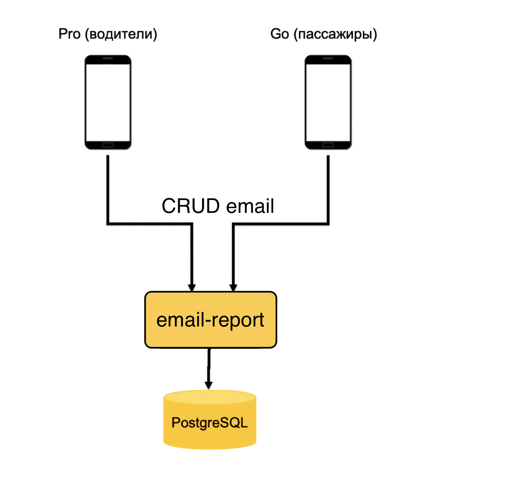

# feature_yandex_go
## Фича - Отправка отчета о поездке на почту.

### Описание задачи:
- Как добавлять новую почту в приложении, как подтверждать почту.
- Понять, в какой момент должен отправляться отчет.
- Продумать ситуацию, когда пользователь обращается в поддержку 
  и хочет получить отчет по прошлым поездкам.
  
### Гипотезы
- Увеличение прибыли за счет привлечение организаций, которые оплачивают 
  проезд работникам(командировка, служебные поездки и т.д.). 
  Данные отчеты нужны, чтобы отчитываться о своих затратах перед работодателем.
- Автоматизация получения отчетов о поездках для водителей, сокращение затрат
  времени за счет меньшего взаимодействия людей. Не нужно ездить в офис.
- Привлечение клиентов, которые постоянно отслеживают свои доходы и расходы,
  для этого им нужна соответствующая квитанция(чек, отчет).
  
### MVP вариант
После завершения заказа сразу отправлять данные по заказу на почту, 
  если (в моделе пользователя есть поле с почтой и) она присутствует.

Считаю, что данный функционал очень полезен и обязан быть. Следовательно, 
  в MVP не нуждается. (Разработка занимает относительно мало времени)

### Полноценный вариант микросервиса

####Добавление почты
Два варианта:
1) либо пользователь хочет добавить почту
2) либо пользователь хочет изменить почту

В зависимости есть ли почта у пользователя, формируется определенный запрос 
  (create или update), к записи добавляется флаг(email_is_confirmed = False) 
  почты. Делаем таск(фоновая задача), таск делает выборку по полю 
  email_is_confirmed, в котором значение False, формирует сообщение с токеном 
  подтверждения и отправляем на указанную почту клиенту.
  При переходе по ссылке, почта подтверждается (email_is_confirmed = True).

#### Отправка отчета
После завершения заказа, отправляем на API email/send: 
  id-пользователя, id заказа и добавляем флаг(is_send). Далее в приложение 
  email-report, таск делает запрос к API orders(по id пользователя и id заказа)
  и отправляет отчет пользователю по email. 

#### Запрос отчета по прошлым поездкам
Указывается id-пользователя и промежуток времени за который нужен отчет.
  Таск делает запрос к API orders(по id пользователя и промежутку даты), 
  получает ответ в виде выборки списка заказов, оправляет отчет пользователю.

### Схема архитектуры

### API
Описание [api.yaml](api.yaml)
- create email: /email/create
- read email: /email/read
- update email: /email/update
- delete email: /email/delete
- confirm email: /email/confirm
- period email: /email/send_report_period
- send report email: /email/send_report

### Юнит Тесты
- проверка отправки письма на почту с ссылкой на изменения почты
- проверка изменения почты при переходе по ссылке
- проверка отправки отчета после завершения поездки
- проверка отправки отчета за определенный период
- проверка удаления почты

### Эксперимент
1) Сначала включаем на себя, тестируем добавление почты и ее подтверждение. 
   Далее делаем тестовую поездку и проверяем получение отчета. Так же тестируем 
   получение отчета за определенный период. 
2) Включаем на команду/Яндекс
3) Далее постепенно в процентном соотношение включаем на весь мир 

### Кварги
exp_kwargs = {'user_id': 123, 'city_id': 5, country: 'RU'} и т. д.

### Метрики
- Метрики по нагрузке. 
- Логи, есть ли ошибки.
- Количество запросов на получения отчетов.
- Уменьшилось ли количество обращений водителей в офисы.
- Процент увеличения корпоративных клиентов.
