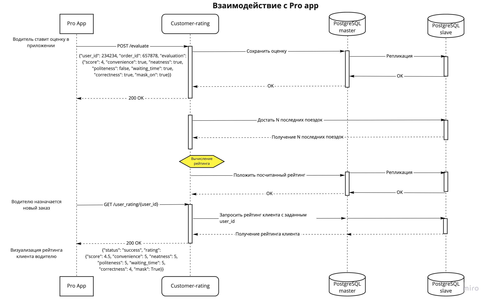

# Задание №1. Архитектура фичи рейтинга пассажиров.
### Описание

Предлагается ввести пользовательский рейтинг для клиентов Яндекс.Такси на основе оценок, выставляемых водителями после
поездки. Цель введения фичи — повлиять на поведение пассажиров и создать более благоприятную атмосферу как для водителей,
так и для пассажиров. Добавление рейтинга пассажира позволит подтолкнуть людей к осознанному отношению к водителям и их 
автомобилям. 

### Гипотезы
1. Поддержание собственного высокого рейтинга будет стимулировать пользователей такси выбирать более удобные точки для 
   подачи автомобиля, сокращать время ожидания для водителя и подробнее указывать детали заказа.
   
2. В период пандемии важно соблюдать ношение средств защиты. Для пассажиров, пренебрегающих этим, существует "наказание"
   в виде снижения рейтинга.
   
3. Возможность быть оцененным заставит пассажира быть вежливее к водителю и бережнее к его авто.

### Этапы реализации
* MVP - добавление оценки пассажира водителем после поездки путем выставления от 1 до 5 звёздочек,
  расчет рейтинга по историческим данным поездок для каждого клиента, вывод общего рейтинга в клиентском приложении в 
  виде средневзвешенной суммы — одного числа.
  
___
* Полноценный вариант — помимо звёзд, у водителя есть возможность выбрать чем именно понравился или не понравился 
  пассажир по следующим категориям:
    * Удобство подачи
    * Аккуратность к автомобилю
    * Время ожидания
    * Вежливость
    * Подробность описания заказа 
      
Выбор выглядит как список иконок, каждую из которых можно отметить.
Так же, имеется возможность отметить наличие индивидуальных средств защиты у пассажира.
Пассажиру, помимо общего числового рейтинга, по тапу доступна небольшая статистика по его прошлым поездкам, например, 
в виде _полярной диаграммы_, где изображены перечисленные выше категории и его рейтинг по каждой из них.

___

### Архитектура и сценарии

Сервис реализуется микросервисом **customer-rating**, написанным на Python (выбран по принципу
собственной экспертизы). Предусмотрены две ручки - POST на добавление оценки (если таковой еще нет с переданным OperationID), и GET на её получение.
Оценки хранятся в PostgreSQL БД в таблице следующего вида:

|   OrderID  |   UserID |   OrderID  | Score | Convenience| Neatness | Politeness | Waiting_time | Correctness |  OperationID | MaskOn  | DateTimeFinished |
| :--------: | :------: | :--------: | :---: | :--------: | :------: | :--------: | :----------: | :---------: |  :---------: |:-------:| :--------------: |
|   11111    |  22222   |   33333    |   4   |    True    |   False  |    True    |    False     |     True    |    12345     |  True   | 2021-06-07 23:12:04 |
|   44444    |  55555   |   66666    |   5   |    True    |   True   |    True    |    True      |     True    |    56789     |  False  | 2021-06-07 21:10:02 |

База реплицируется.

Диаграммы взаимодействия:

---

### API
Ручка POST добавляет запись в таблицу с пришедшей в JSON'e оценкой пользователя, ручка GET берет N строк из таблицы,
отсортированной по дате, и вычисляет средневзвешенный рейтинг по "звездным" (поле Score) оценкам. Наибольший вес имеет 
самая свежая оценка, наименьший — самая старая, однако контролировать массив весов можно так же при помощи конфиг-файла.
Подробнее смотреть в *customer-rating.yml* 

### Про рейтинг
В расширенном варианте так же вычисляется рейтинг по каждому из параметров "порядочности" пассажира. 

### Тесты

### Раскатка
